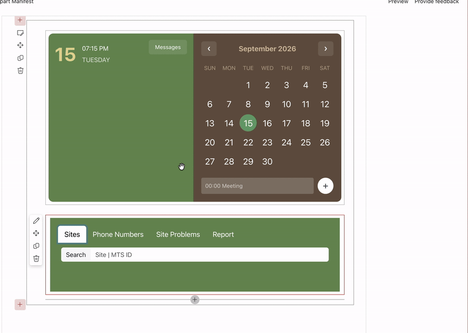

# spfx-template-se

## Summary

SharePoint Framework web parts for SharePoint Subscription Edition. The solution includes a calendar and events experience and a site operations dashboard backed by SharePoint lists.

The project uses React, TypeScript, PnPjs, Bootstrap, and SharePoint Framework client-side web parts.

## Demo

The following recording shows the custom calendar search bar in the calendar events experience:

The demo asset is stored at `docs/assets/custom-calender-search-bar.gif`.

## Features

### Calendar Events web part

- Search and browse calendar events by date.
- Create and update events with title, location, description, category, start time, and end time.
- Supports recurring and completed event state.
- Filters events by categories such as Meeting, Work hours, Business, Holiday, Get-together, Gifts, and Anniversary.
- Uses SharePoint data through the PnPjs-backed CRUD helpers in this repository.

### Site operations web part

- Browse and search SharePoint sites with site type, location, power source, priority, security, and contact details.
- Browse useful phone numbers by category.
- Review site problems and associate them with sites, devices, device types, and device categories.
- Create and submit reports.
- Loads SharePoint users and list data through the shared CRUD operations and helper classes.
- Uses Bootstrap navigation, tabs, forms, tables, and responsive layout styles.

This extension illustrates the following concepts:

- Building multiple React-based SPFx web parts in one solution.
- Reading and writing SharePoint list data from a client-side web part.
- Sharing TypeScript interfaces, CRUD operations, and helper classes across web parts.
- Combining SPFx styles with Bootstrap and CSS modules.

## Used SharePoint Framework Version

The project targets SharePoint Framework `1.4.1` and uses the SPFx build toolchain from `@microsoft/sp-build-web` `~1.4.1`.

## Applies to

- [SharePoint Framework](https://aka.ms/spfx)
- [Microsoft 365 tenant](https://docs.microsoft.com/en-us/sharepoint/dev/spfx/set-up-your-developer-tenant)

> Get your own free development tenant by subscribing to [Microsoft 365 developer program](http://aka.ms/o365devprogram)

## Prerequisites

- Node.js `6.11.5` is the legacy Node.js version associated with SPFx `1.4.1`.
- Gulp `3.9.1` is declared by this project.
- npm and access to a SharePoint Subscription Edition site.
- SharePoint lists used by the web parts, including `Site`, `Devices`, `DeviceTypes`, `DeviceCategory`, and the calendar event lists.

> The current development machine reports Node.js `v22.22.2`. That version is newer than the SPFx `1.4.1` toolchain and may require a Node version manager to switch to the legacy runtime before building.

## Solution

| Solution         | Author(s)                                                          |
| ---------------- | ------------------------------------------------------------------ |
| spfx-template-se | SharePoint Framework web parts for SharePoint Subscription Edition |

## Version history

| Version | Date               | Comments                                                                          |
| ------- | ------------------ | --------------------------------------------------------------------------------- |
| 1.2     | September 15, 2026 | Documented the current web parts, toolchain, and added a calendar search bar demo |
| 1.1     | March 10, 2021     | Update comment                                                                    |
| 1.0     | January 29, 2021   | Initial release                                                                   |

## Disclaimer

**THIS CODE IS PROVIDED _AS IS_ WITHOUT WARRANTY OF ANY KIND, EITHER EXPRESS OR IMPLIED, INCLUDING ANY IMPLIED WARRANTIES OF FITNESS FOR A PARTICULAR PURPOSE, MERCHANTABILITY, OR NON-INFRINGEMENT.**

---

## Minimal Path to Awesome

- Clone this repository
- Ensure that you are at the solution folder
- Use the Node.js version required by the SPFx `1.4.1` toolchain.
- Install dependencies with `npm install`.
- Start the local workbench with `npx gulp serve` or `./node_modules/.bin/gulp serve`.
- Open the SharePoint workbench and add either web part to a page.

## References

- [Getting started with SharePoint Framework](https://docs.microsoft.com/en-us/sharepoint/dev/spfx/set-up-your-developer-tenant)
- [Building for Microsoft teams](https://docs.microsoft.com/en-us/sharepoint/dev/spfx/build-for-teams-overview)
- [Use Microsoft Graph in your solution](https://docs.microsoft.com/en-us/sharepoint/dev/spfx/web-parts/get-started/using-microsoft-graph-apis)
- [Publish SharePoint Framework applications to the Marketplace](https://docs.microsoft.com/en-us/sharepoint/dev/spfx/publish-to-marketplace-overview)
- [Microsoft 365 Patterns and Practices](https://aka.ms/m365pnp) - Guidance, tooling, samples and open-source controls for your Microsoft 365 development
